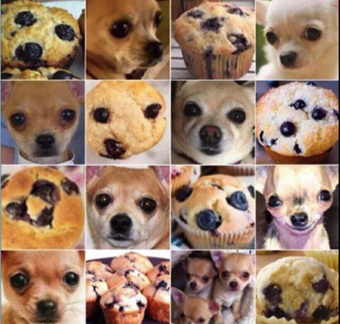
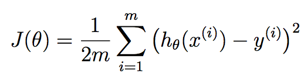
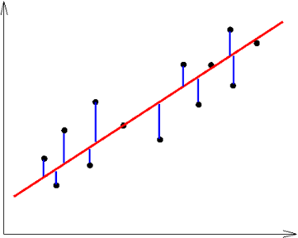

title: WTF is Machine Learning?
author:
  name: Beato Bongco
  url: https://beatobongco.com
output: 2017-08-04_WTF_is_Machine_Learning.html
controls: true
--

# WTF is Machine Learning?

##  
--

### Basically: Learning from XP

--

### A little more formally...

"A computer program is said to learn from experience E with respect to some class of tasks T and performance measure P, if its performance at tasks in T, as measured by P, improves with experience E." - Tom Mitchell

--

# Why should I care?

##  

--

### ML enables self-driving vehicles

Cars, ships, planes, drones, and ...[pancake flipping robots](https://www.youtube.com/watch?v=W_gxLKSsSIE)?

--

### Image detection

Visual search, [shopping](https://www.youtube.com/watch?v=NrmMk1Myrxc) w/ no checkout lines, [cucumber sorting](https://www.youtube.com/watch?v=4HCE1P-m1l8).

--

### Natural language processing

Translation, understanding queries, support automation, [virtual coaches](https://www.youtube.com/watch?v=krdwB8bfXLQ).

--

### Content creation

[Generative music](https://deepjazz.io/), AI writers for articles and [movies](https://www.youtube.com/watch?v=LY7x2Ihqjmc).

--

### And many more!

* general prediction
* medicine
* pathfinding
* game playing
* optimization
* pretty sure there's even more...

--

# OK, how do they do it?

##  

--

### Warning

##
* General and basic introduction
* Doesn't apply for all kinds of machine learning
* Useful for intuition
* Let's start with **supervised learning**

--

### What is ML revisited: How does a machine "learn by experience"?

#### Setup

1. You want a certain output given a certain input.
2. Too hard or too infeasible to program a solution.
3. Use ML!

--

### Supervised learning overview

4. Give machine lots of training data where you provide the answers / correct output.
4. Feed into machine, not showing it the answers.
4. Machine tries to answer.
4. Compare machine's answers to correct output.
4. Tell the machine how far off it's answers were.
5. Machine optimizes self using ~~magic~~ **math**.
5. Do steps 2-6 a __shitton__ of times.
6. Machine can now give you the output you want on data it hasn't seen yet.
7. Mind === blown.

--

### Example: apple-or-not bot

<link rel="stylesheet" type="text/css" href="https://cdnjs.cloudflare.com/ajax/libs/flexboxgrid/6.3.1/flexboxgrid.min.css">
<link rel="stylesheet" type="text/css" href="https://cdnjs.cloudflare.com/ajax/libs/animate.css/3.5.2/animate.min.css">
<link rel="stylesheet" type="text/css" href="static/css/wtfisml.css">

  

    

      <transition name="fade">
        

          
Apple!

          
Not apple.

          
Not apple.

          
Apple!

          
/

        

      </transition>
      <transition name="fade">
        

          
Oops, adjusting...

          
/

        

      </transition>
    

    

      
    

  

  

    

      
      

        
Accuracy:

        

        <strong>{{readableAccuracy}}</strong>
        

        
%

      

    

    

      

        <transition name="fadeLeft">
          
        </transition>
      

    

  

  

    

      <button @click="showFruit">Show a fruit</button>
    

  

Click on the button above! This is a robot that learns to identify apples among other fruits. Let's call him Gary.

--

### More formal example: predict house prices

* Say we want to predict housing prices given a house's area.
* Just area is insufficient to actually predict house prices, but just pay attention to concepts.

--

### Collect

Go outside, look at houses and get area and price. Once you've visited around a thousand houses, plot all house data out on a graph (x: area, y: price)

--

The intuition is, we want our machine (who we'll call Gary, after our apple-bot) to draw a line that best fits our data. From this line, we will be able to predict house prices given house areas our machine hasn't seen yet.

Remember the formula for a line? `y = mx + b`
This is called our *model*.

--

### Le weights

We want Gary to draw that line for us. He can do that by plugging in values to `m` and `b`.

These are called *weights* and are usually denoted by the greek letter Theta (Θ). For now, since Gary is untrained, let's just set `m` and `b` to 0.

It is Gary's job to find the best values for the weights, to get the best fitting line.

But how do we know if it's the best fitting line?

--

### Enter the cost function

The cost function is how you tell Gary he's wrong. Specifically, it tells Gary **how wrong** he was.

--

Here's the formula. Don't scare, doge.

`m` - number of houses in our dataset (training examples)
`h` - just means apply our weights to our model and get the result

All this is doing is summing up all of our errors and squaring them.

--

Visually, it looks like this:

We're just getting the distance of each training example from the line our machine guessed, squaring them, adding them all together and dividing the result by `2 * num training examples`.

--

Ok, now that Gary knows how bad his answers are, what can he do?

The answer is to turn to ~~meth~~ math!

--

### The magic of gradient descent

Turns out with the magic of derivatives (we will derive the cost function), we can show Gary if a weight should be increased or decreased to minimize the cost function.

--

### Down from the hill

A helpful analogy for gradient descent is that we're throwing Gary off a hill.

--

### Derivatives/Gradients == gravity

Another name for derivatives are gradients (thus gradient descent).

I won't go into details of how to get derivatives (lots of nice tuts online) but just think of them as gravity, telling Gary's poor body where to go.

The more downwards Gary falls, the lower the cost function, thus the less we shame him for failing us.

So it follows that Gary's goal is to try to reach the bottom.

--

### Doing the descent + learning rate

Each time Gary trains, all we have to do is subtract each weight by a number (learning rate) times the gradient. Think of learning rate as how big a fall off the hill Gary takes at a time.

We just keep doing the descent and adjusting our weights until our cost function doesn't decrease by much (like less than some tiny number 0.0001).

--

### Mega reward

Once we're satisfied that Gary has fallen enough, he's ready to predict house prices with his weights!

--

We'll find some house we haven't seen yet, get their area as x, apply Gary's weights and we should get a number that predicts the price of that house! Recall `y = mx + b`.

Get your price by calculating `price = weight1 * house area + weight2`

--

### Intuition: ML is just models and weights

As a recap, takeaway the following:

* **Model** - the features (and modifications to them) you choose to use
* **Weights** - numbers applied to the model to get the output. This is what our algorithm tries to find via optimization.

--

### Hungry for ~~apples~~ more?

* [Deep Learning](https://www.technologyreview.com/s/513696/deep-learning/) is current hot trend
* Uses deeply layered [Neural Networks](http://pages.cs.wisc.edu/~bolo/shipyard/neural/local.html)
* Very good for image classification and understanding text/speech
* A lot more things to learn on top of what we discussed but underlying concepts are the same
* Check out ML moocs, like [Stanford's Machine Learning course by Andrew Ng](https://www.coursera.org/learn/machine-learning)
* Check out the [fast.ai](http://course.fast.ai) course
--

# Thank you!
## 

--

### Sources

* [The Promise of AI - Frank Chen of Andreessen Horowitz](https://vimeo.com/215926017)
* [Stanford's Machine Learning course by Andrew Ng](https://www.coursera.org/learn/machine-learning)
